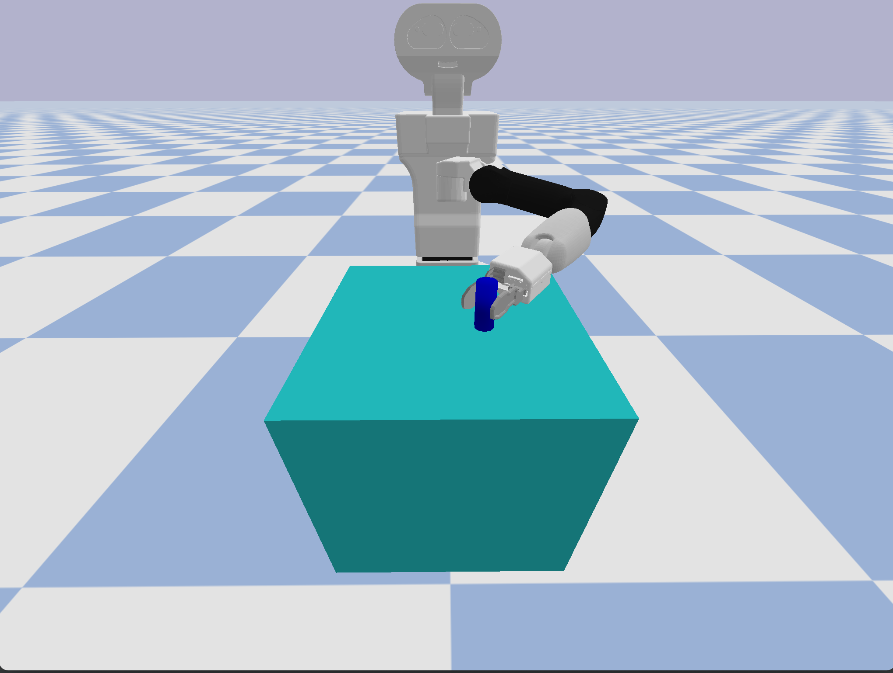
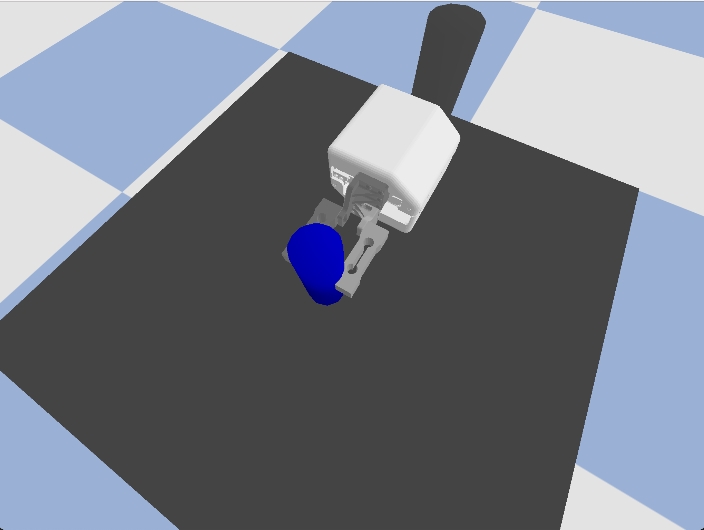

<h1 align="center">Reinforcement Learning Environments for TIAGo</h1>

---

This repository contains simulation environments for the TIAGo robot based on [pybullet](https://github.com/bulletphysics/bullet3).
They follow OpenAI's [gym](https://github.com/openai/gym) environment structure in order to by used in combination with 
reinforcement learning algorithms that follow the same convention (e.g. [baselines](https://github.com/openai/baselines)).

## Install Dependencies

Install dependencies using:
`pip install -r requirements.txt`

## Environments

Currently, this repository contains three different environments. 
All of them are based on OpenAI's [robotics environments](https://github.com/openai/gym/tree/master/gym/envs/robotics)
and thus similar to them in many regards.
As opposed to the standard robotics environments, this package offers tactile sensors also for mobile manipulators.

### TIAGoPALGripperEnv

[TIAGoPALGripperEnv](./tiago_rl/envs/tiago_env.py): TIAGo with PAL Gripper using standard (non-sensorized) fingers.

[TIAGoTactileEnv](./tiago_rl/envs/load_cell_tactile_env.py): TIAGo with PAL Gripper using TA11 load cell sensors as fingers.

[GripperTactileEnv](./tiago_rl/envs/load_cell_tactile_env.py): Only PAL Gripper using TA11 load cell sensors as fingers.
Uses not as many complex collision bodies and thus may speed up policy learning for gripper-only policies.

